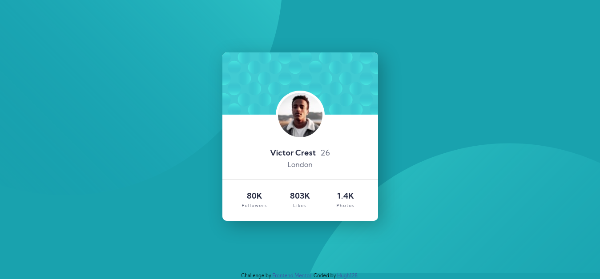
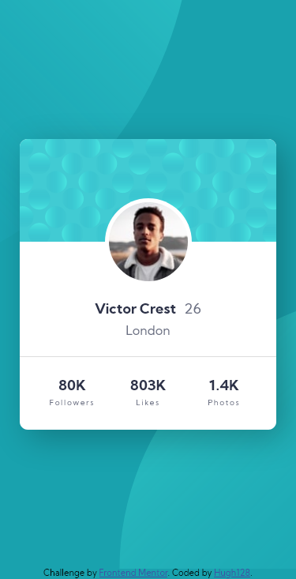

# Frontend Mentor - Profile card component solution

This is a solution to the [Profile card component challenge on Frontend Mentor](https://www.frontendmentor.io/challenges/profile-card-component-cfArpWshJ). Frontend Mentor challenges help you improve your coding skills by building realistic projects. 

## Table of contents

- [Overview](#overview)
  - [The challenge](#the-challenge)
  - [Screenshot](#screenshot)
  - [Links](#links)
- [Built with](#built-with)
- [Author](#author)

## Overview

This code creates a user profile card. Made with HTML and CSS Flexbox.

### The challenge

- Build out the project to the designs provided

### Screenshot

Desktop 1440px

Desktop 1366px

Mobile 375px

### Links

- Solution URL: [Add solution URL here](https://your-solution-url.com)
- Live Site URL: [Add live site URL here](https://your-live-site-url.com)

### Built with

- Semantic HTML5 markup
- CSS
- Flexbox

# Author

- Github - [Hugh](https://github.com/hugh128)
- Frontend Mentor - [@hugh128](https://www.frontendmentor.io/profile/hugh128)